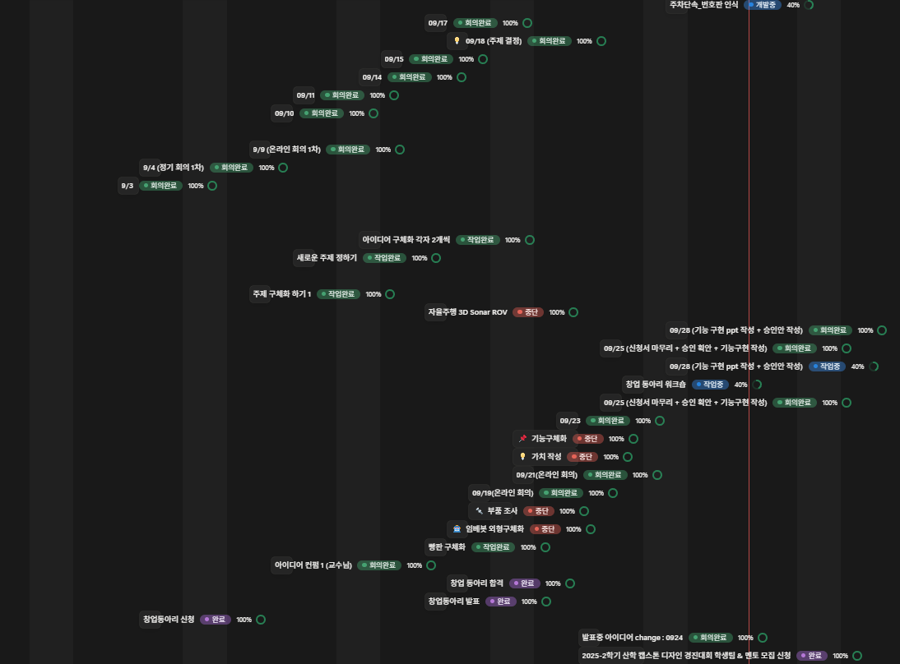

# Meeting_Minutes

## 📅 프로젝트 타임라인



## 📊 주요 마일스톤

| 날짜 | 주요 내용 | 상태 |
|------|-----------|------|
| 07/28 | 초기 회의 진행 | ✅ 완료 |
| 08/07 | 프로젝트 방향 논의 | ✅ 완료 |
| 08/15 | 아이디어 구체화 | ✅ 완료 |
| 09/04 | 아이디어 발표 및 피드백 | ✅ 완료 |
| 09/09 | 조교님 피드백 반영 | ✅ 완료 |
| 09/11 | 새로운 아이디어 브레인스토밍 | ✅ 완료 |
| 09/14 | **스마트 브레드보드** 최종 선정 | ✅ 완료 |
| 09/15 | **3D 소나 ROV** 아이디어 추가 | ✅ 완료 |
| 09/17 | **교수님 아이디어 발표** | ✅ 완료 |
| 09/19 | **스마트 로봇 프로젝트 확정** | ✅ 완료 |
| 09/22 | **길안내 로봇 기능 구체화** | ✅ 완료 |
| 09/25 | **주차 단속 로봇으로 방향 전환** | ✅ 완료 |

---

## 🎯 최종 선정 프로젝트: 스마트 주차 단속 로봇

### 핵심 기능
- **주차장 자율주행** (메인 기능)
- **불법 주차 차량 인식**
- **차량 회피 및 안전 주행**
- **충돌 방지 시스템**

### 기술 스택
- LiDAR 기반 장애물 감지
- 카메라 기반 차량 인식
- 자율주행 및 경로 계획
- 안전 제동 시스템


---

## 📝 회의 기록 요약

### 0주차 (프로젝트 시작)
- **07/28**: 초기 회의 진행
- **08/07**: 프로젝트 방향 논의  
- **08/15**: 아이디어 구체화

### 1주차 (아이디어 탐색)
- **09/04**: 아이디어 발표 및 피드백

### 2주차 (방향성 정립)
- **09/09**: 조교님 피드백 반영, 아이디어 수정 (스마트 전등 커버, 발바닥 교정 깔창, 회의 도우미, 책-연동 다감각 스토리 디바이스)
- **09/11**: 새로운 아이디어 브레인스토밍 (벌레 유도 장치, 적외선 보행 보조, 편의점 네비게이션 등 - 대부분 보류/기각)
- **09/14**: 추가 아이디어 검토 및 **스마트 브레드보드** 최종 선정

### 3주차 (프로젝트 확정)
- **09/15**: **3D 소나 ROV** 아이디어 추가, 브레드보드와 함께 선택지로 유지
- **09/17**: 교수님께 3가지 아이디어 발표 (스마트 브레드보드, ROV, 좌석 관리 시스템)
- **09/19**: **상호작용 가능한 스마트 로봇** 최종 확정

### 4주차 (프로젝트 방향 전환)
- **09/22**: **길안내 로봇 기능 구체화** (자율주행, 장애물 인식, 상호작용 기능 정의)
- **09/25**: **주차 단속 로봇으로 방향 전환** (멘토 지원 체계 확정, 역할 분담)

---

## 🚀 향후 계획

### 현재 진행 상황 (09/25)
- **프로젝트 확정**: 스마트 주차 단속 로봇
- **멘토 배정**: 조항재 대학원생, LiDAR 전문가 박사과정 선배
- **역할 분담**: 하드웨어(멘토) + 소프트웨어(팀)
- **다음 단계**: PPT 작성, 서류 재작성 후 교수님 승인

### 개발 계획
- **하드웨어**: LiDAR + 카메라 센서 융합
- **소프트웨어**: 자율주행, 차량 인식, 충돌 회피 알고리즘
- **실험 환경**: 주말 저녁 시간대 (차량 없는 주차장)
- **안전성**: 차량과의 충돌 방지를 최우선으로 설계

### 대회 일정
- **메이커스 대회**: 12월 전시 (10월 신청)
- **기타 대회**: 내년 3-4월 (한이음 등)
- **예산**: 창동 지원 활용 예정

---

## 📂 폴더 구조

```
Meeting_Minutes/
├── 0주차/
│   ├── 0728_meeting.md
│   ├── 0807_meeting.md
│   └── 0815_meeting.md
├── 1주차/
│   └── 0904_meeting.md
├── 2주차/
│   ├── 0909_meeting.md
│   ├── 0911_meeting.md
│   └── 0914_meeting.md
├── 3주차/
│   ├── 0915_meeting.md
│   ├── 0917_meeting.md
│   └── 0919_meeting.md
├── 4주차/
│   ├── 0922_meeting.md
│   └── 0925_meeting.md
├── images/
│   └── timeline.png
└── README.md
```
